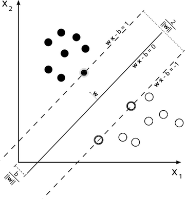

```{r initial, echo = FALSE, cache = FALSE, results = 'hide'}
library(knitr)
options(htmltools.dir.version = FALSE, tibble.width = 60)
opts_chunk$set(
  echo = FALSE, warning = FALSE, message = FALSE, comment = "#>",
  fig.path = 'figure/', cache.path = 'cache/', fig.align = 'center', 
  fig.width = 12, fig.height = 8, fig.show = 'hold', 
  cache = TRUE, external = TRUE, dev = 'CairoPNG', dpi = 300
)
```

```{r cache=FALSE}
library(tidyverse)
library(stringr)
library(gridExtra)
library(mvtnorm)
library(MASS)
library(e1071)
library(randomForest)
library(nnet)
library(meifly)
library(plotly)
library(GGally)
library(tourr)
library(RColorBrewer)
library(tsne)
library(PPtreeViz)
```

class: inverse middle 
## Who are we?

.pull-left[
Di is
  - Professor of Business Analytics at Monash Uni
  - Editor of the Journal of Computational and Graphical Statistics
  - Fellow of the American Statistical Association
  - Ordinary Member of the R Foundation
  - Loves tennis, soccer and cricket
]

.pull-right[
Eun-Kyung is
  - Associate Professor at EWHA Women's University, Seoul, Korea
  - Chair of the Department for 3 more months!
  - Associate Editor of the Journal of Computational and Graphical Statistics
  - Author of many R packages, including PPtreeViz, PPtree, EMSaov, asVPC
  - Loves sleeping!
]

---

class: inverse middle 
## Getting setup

- Download a zipped copy of the slides and data from [https://github.com/EK-Lee/WOMBAT-2017](https://github.com/EK-Lee/WOMBAT-2017)
- To follow along with the slides, open the file `VisualDM.html`
- To run the code examples, open `VisualDM.Rmd` in RStudio
- Cheatsheets for [rmarkdown](https://www.rstudio.com/wp-content/uploads/2016/03/rmarkdown-cheatsheet-2.0.pdf), [ggplot2](https://www.rstudio.com/wp-content/uploads/2016/11/ggplot2-cheatsheet-2.1.pdf), [shiny](https://www.rstudio.com/wp-content/uploads/2016/01/shiny-cheatsheet.pdf)

---

## Conceptual framework

- Visual methods for high-dimensional data are well-developed and understood. Toolbox includes:
    + scatterplot matrices
    + parallel coordinate plots
    + interactive tools like brushing and linking
    + dynamic methods like tours
- These methods can also be used to visualise our models, often leading to some surprise that the fitted models may be different from expected.

---

## Questions to answer

- What does the model look like? How does the model change when its parameters change? How do the parameters change when the data is changed?
- How well does the model fit the data? How does the shape of the model compare to the shape of the data? Is the model fitting uniformly good, or good in some regions but poor in other regions? Where might the fit be improved?

---


## Key strategies

- Display the model in data space (m-in-ds), as well as the data in the model space.
- Look at all members of a collection of a model, not just a single one.
- Explore the process of fitting, not just the end result.

---


## Model in the data space

```{r}
simd1 <- data.frame(x=runif(100))
simd1 <- simd1 %>% mutate(y=c(5+3*x[-100]+rnorm(99), 15))
simd1_lm <- lm(y~x, data=simd1)
simd1 <- simd1 %>% mutate(res = residuals(simd1_lm))
p1 <- ggplot(simd1, aes(x=res)) + geom_histogram(binwidth=0.5) + 
  ggtitle("Data in the model space") +
  xlab("Residuals") + theme(aspect.ratio=1)
coefs <- coefficients(simd1_lm)
p2 <- ggplot(simd1, aes(x=x, y=y)) + geom_point() +
  geom_abline(intercept=coefs[1], slope=coefs[2]) +
  ggtitle("Model in the data space") + 
  theme(aspect.ratio=1)
grid.arrange(p1, p2, ncol=2)
```

---


## Model in the data space

```{r}
g1 <- rmvnorm(n=120, mean=c(1,2), sigma=matrix(c(4,2,2,3), ncol=2)) 
g2 <- rmvnorm(n=80, mean=c(-1,-3), sigma=matrix(c(6,-3,-3,6), ncol=2))
simd2 <- data.frame(x1=c(g1[,1], g2[,1]), x2=c(g1[,2], g2[,2]), g=c(rep("A", 120), rep("B", 80)))
simd2_lda <- lda(g~., data=simd2, prior=c(0.5, 0.5))
simd2 <- simd2 %>% 
  mutate(pred = as.vector(predict(simd2_lda)$x[,1]))
p1 <- ggplot(simd2, aes(x=pred)) + 
  geom_histogram(breaks=seq(-3, 5, 0.5)) + 
  geom_vline(xintercept=0, colour="#7570B3") +
  facet_wrap(~g, ncol=1) +
  ggtitle("Data in the model space")
simd2_grid <- expand.grid(x1=seq(-10,10,0.2), x2=seq(-11,10,0.2)) 
simd2_grid$pred <- predict(simd2_lda, simd2_grid)$class
p2 <- ggplot(simd2_grid, aes(x=x1, y=x2, colour=pred)) + 
  geom_point(alpha=0.1) +
  geom_point(data=simd2, aes(x=x1, y=x2, colour=g), 
             shape=4, size=3, inherit.aes = FALSE) +
  scale_colour_brewer("", palette="Dark2") +
  ggtitle("Model in the data space") + 
  theme_bw() + theme(aspect.ratio=1)
grid.arrange(p1, p2, ncol=2)
```

---


class: inverse middle center
## Your Turn

For each of the two previous displays, write down one thing that you learn differently from the two different ways of looking at the model and data.

```{r eval=FALSE}
1. 
D-in-MS: Focus is on residuals, see the outlier clearly
M-in-DS: See that the model fits the middle of the data nicely, outlier may have pulled the line
2. 
D-in-M-S: Predictions are routine, some cases misclassified
M-in-D-S: Variances of the two groups are slightly different
```

---


class: inverse middle center
## Your Turn

This is a typical diagram used to explain how to build a Support Vector Machine. Is it M-in-DS or D-in-MS??



Illustration produced by cyc, creative commons license, available on wikipedia

---


## All members of a collective

- All possible models,  e.g. for a linear regression, we can generate all possible main effects models.
- Same model fit to subsets: neural networks (ensembles of logistic models), random forests (ensembles of trees)

---


## Linear regression

- Model level: model fit statistics. $m$ observations.
- Model-estimate level: coefficient estimates on various scales. $m \times p$ observations.
- Estimate level: summary of estimates over the models. $p$ observations.
- Model-observation level: residuals and influence measures. $m \times n$ observations.
 Observation level: the original data, plus summaries of residual behavior. $n$ observations.

---


## All possible models

```{r results='hide'}
# devtools::install_github("hadley/meifly")
rescale01 <- function(x) (x - min(x, na.rm = TRUE)) / diff(range(x, na.rm = TRUE))

# Fit all linear models to New Haven data --------------------------------------

data(NewHavenResidential, package = "barcode")

y <- scale(NewHavenResidential[,1])
x <- NewHavenResidential[,-c(1,3)]
x$livingArea <- scale(x$livingArea)
x$size <- scale(x$size)
x$bedrms <- scale(x$bedrms)
x$bathrms <- scale(x$bathrms)
models <- fitall(y, x)
# ggobi(models, NewHavenResidential)

# Summary statistics -----------------------------------------------------------

model_sum <- models %>%
  summary() %>%
  tbl_df() %>%
  gather(statistic, val, logL:adjR2) %>%
  group_by(statistic) %>% 
  mutate(stdval = rescale01(val), df = df - 1) %>%
  group_by(statistic, df) %>% mutate(rank = min_rank(desc(val))) %>%
  ungroup()

mnames <- function(m) {
  name <- str_c(names(coefficients(m))[-1], collapse=",")
  return(name)
}
model_r2 <- models %>% 
  plyr::ldply(mnames, .id = "model") %>% 
  dplyr::rename(name=V1) %>%
  right_join(model_sum, by = "model") %>%
  filter(statistic == "R2")

p <- ggplot(model_r2, aes(x=df, y=val, label=name)) +
  geom_point() +
  geom_line(data = filter(model_r2, rank == 1)) +
  #facet_wrap(~statistic, ncol = 5) +
  xlab("Degrees of Freedom") +
  ylab("R2")
```

```{r fig.width=9, fig.height=7}
ggplotly(p)
```

---


## Coefficients

```{r}
f_coef <- function(x) {
  coef <- coefficients(x)
  df <- matrix(rep(0, 8), ncol=8)
  colnames(df)=c("(Intercept)","livingArea",
         "size","zoneRM","zoneRS","acTypeNo AC", 
         "bedrms","bathrms")
    data.frame(coef=rep(0, 9))
  df[colnames(df) %in% names(coef)] <- coef
  colnames(df)[1] <- "Intercept"
  return(data.frame(df))
}
model_coef <- models %>% 
  map(f_coef) %>%
  map_df(bind_rows) %>%
  select(-Intercept) %>%
  mutate(id = 1:nrow(.)) %>%
  gather(var, val, -id) #%>%
  #group_by(var) %>% 
  #mutate(stdval = rescale(val))
model_coef$var <- factor(model_coef$var, 
                         levels=unique(model_coef$var)) 

```

```{r fig.width=9, fig.height=7}
p <- ggplot(model_coef, aes(x = var, y = val,  
                     key = id, text = id)) + 
  #geom_jitter(width = 0.25, alpha = 0.5) +
    geom_line(aes(group = id), alpha = 0.2) +
    geom_point(alpha = 0.5, size = 0.001) +
    theme_bw() + xlab("") + ylab("Standardised coefficients")
ggplotly(p, tooltip = c("var", "val", "key")) %>% layout(dragmode = "select")
```

---


## Neural networks

$$P(y \in \textrm{class}_j | x_{1}, ..., x_{p}) = k \cdot \phi ( \alpha + \sum_{h=1}^s w_{hj} \phi (\alpha_h + \sum_{i=1}^p w_{ih} x_i ))$$

```{r}
w <- read_csv("wiggly.csv")[ ,2:4]
w <- transform(w, class = factor(class, labels = c("A", "B")))
sqr <- theme(aspect.ratio = 1)
nolab <- list(scale_x_continuous(""), scale_y_continuous(""))
col_d <- scale_colour_manual(values = c("#377EB8", "#E41A1C"))
fill_c <- scale_fill_gradient2(low = "#E41A1C", mid = "white", high = "#377EB8",
  midpoint = 0.5)
load("wiggly-multi.rdata")
many <- rbind(many2$coef, many3$coef, many4$coef)
many <- plyr::rename(many, c(size = "nodes"))
many$id <- (many$nodes - 2) * 200 + as.integer(many$i)
source("explore.r")
best <- Filter(function(x) accuracy(x) == 1, many4$all)[[1]]
```

```{r}
p1 <- ggplot(subset(best$output,  node == 1), aes(x, y)) +
  geom_raster(aes(fill = pred)) +
  geom_point(aes(shape = class), data = w) +
  sqr +
  fill_c +
  nolab
p2 <- ggplot(best$hidden, aes(x, y)) +
  geom_contour(aes(z = pred, group = node), colour = "grey50", size = 2,
    breaks = 0.5) +
  geom_point(aes(colour = class, shape = class), data = w) +
  sqr + col_d + nolab
grid.arrange(p1, p2, ncol=2)
```

---


## Hidden nodes

```{r}
hidden_fill <- scale_fill_gradient2(low = "#AF8DC3", mid = "#F7F7F7",
  high = "#7FBF7B", midpoint = 0.5, limits = c(0, 1))

ggplot(best$hidden, aes(x, y)) +
  geom_raster(aes(fill = pred)) +
  geom_point(aes(shape = class), data = w) +
  sqr +
  facet_grid(. ~ node) +
  hidden_fill +
  nolab
```

---


class: inverse middle 
## Your Turn

- In the formula for the model, what is $s$ and $p$?
- Sketch the neural network diagram that corresponds to the best model.

---


## Explore the process of fitting

<iframe src="https://player.vimeo.com/video/767832" width="640" height="483" frameborder="0" webkitallowfullscreen mozallowfullscreen allowfullscreen></iframe>

---


## Model comparison

```{r fig.height=5}
qual <- unique(many[, c("value", "accuracy", "nodes", "id")])
ggplot(data = qual, aes(x=accuracy, y=value)) + 
  geom_point() +
  xlab("Accuracy") +
  ylab("Value of fitting criterion") + 
  facet_wrap(~ nodes)
```

---


## Boundaries for each model

```{r}
all <- mapply(function(nn, i, j) {
  df <- subset(nn$output, node==1)
  df$id <- i
  df$nodes <- j
  df
}, c(many2$all,many3$all,many4$all), 1:600, 
  rep(2:4, each=200), SIMPLIFY = FALSE)
all <- do.call("rbind", all)

contours <- plyr::ddply(all, plyr::.(nodes, id), 
              function(df) contour(df$x, df$y, df$pred))
contours <- subset(contours, piece == 1)
contours <- merge(contours, qual)
contours$acc <- cut(contours$accuracy, c(0, 0.915, 0.925, 0.98, 1),
  labels = c("Sub-linear", "Linear", "Super-linear", "Excellent"))

ggplot(contours, aes(x, y)) + sqr +
  geom_path(aes(group = id), 
            colour = scales::alpha("grey50", 0.5)) +
  facet_grid(nodes ~ acc) +
  nolab
```

---


## Random forest

- Tree-level: each tree has its own training/test samples
- Variable-level: each variable is ranked by the drop in model performance for each tree
- Observation-level: for each observation we have the distribution of predictions across all trees

We will come back to this later, because the area is very rich.

---


## Visualisation Toolbox

* Grammar of graphics: map variables to graphical elements
* Multivariate data plots: go beyond 2D
* Dimension reduction: get back to 2D 
* Interactive graphics: to explore various aspects quickly, see beyond 2D 

---

## Grammar of graphics

* Tidy data is in a form where variables are provided in columns, and observations in rows. Statistically we have random variables, and a sample from a population. 
* The grammar of graphics (Wilkinson, 1999; Wickham, 2009) provides the mapping of variables to graphical elements:

```{r eval=FALSE, echo=TRUE}
ggplot(df, aes(x=res)) + geom_histogram(binwidth=0.5) 
ggplot(df, aes(x=x, y=y)) + geom_point() +
  geom_abline(intercept=coefs[1], slope=coefs[2]) 
ggplot(df_grid, aes(x=x1, y=x2, colour=pred)) + 
  geom_point(alpha=0.1) +
  geom_point(data=df, aes(x=x1, y=x2, colour=g), 
             shape=4, size=3, inherit.aes = FALSE) +
  scale_colour_brewer("", palette="Dark2")
```

---

## Multivariate plots

* Scatterplot matrix: Matrix layout of all pairs of variables
* Parallel coordinate plot: axes are laid out in parallel, rather than orthogonal, and observations are connected by lines.
* Tours: Movie of all possible low-dimensional projections

---

## Scatterplot matrix

```{r}
ggpairs(NewHavenResidential, columns=c(1,2,4,5))
```

---

class: inverse middle 

## Your Turn

- What do you learn about the relationship between the four variables?
- What transformations might be recommended?
- Are there other cleaning that you would recommend before modeling?

---

## Parallel coordinate plot

```{r}
data(olive)
olive$region <- factor(olive$region, levels=1:3, labels=c("South", "Sardinia", "North"))
ggparcoord(olive, columns=3:10, groupColumn=1,
           order="anyClass") + 
  scale_colour_brewer("", palette="Dark2")
```

---
## Side-by-side boxplots

```{r}
data(olive)
olive$region <- factor(olive$region, levels=1:3, labels=c("South", "Sardinia", "North"))
ggparcoord(olive, columns=3:10, groupColumn=1,
           order="anyClass", boxplot = TRUE, 
           alphaLines = 0.01) + 
  scale_colour_brewer("", palette="Dark2")
```

---

## Parallel coordinate plot

- Values on each variable are standardised. Other choices of scaling are reasonable.
- Ordering of variables helps perceive structure. Here variables have been ordered by any class difference.
- Structure to be seen:
    + because the coloured lines flow differently, there are large differences between the three classes
    + eicosenoic completely separates south
    + sardinia and north separated in oleic and linoleic
    + linolenic is discrete

---

## Tours

A sequence of $d$-dimensional projections, $XA$, of $p$-dimensional data is shown in an animation or movie.

$$X = \left[ \begin{array}{rrrr} 
         x_{11} & x_{12} & \dots & x_{1p}\\
         x_{21} & x_{22} & \dots & x_{2p}\\
         \vdots & \vdots &  & \vdots \\
         x_{n1} & x_{n2} & \dots & x_{nd}
         \end{array} \right]
         ~~~ A = \left[ \begin{array}{rrrr} 
         a_{11} & a_{12} & \dots & a_{1d}\\
         a_{21} & a_{22} & \dots & a_{2d}\\
         \vdots & \vdots &  & \vdots \\
         a_{p1} & a_{p2} & \dots & a_{pd}
         \end{array} \right]$$
         
- Grand: random walk over all possible projections
- Guided: follows an optimisation path of a function
- Little: interpolates between all marginal views
- Manual: user controls contributions from a variable, rotating a variable into or out of a projection
 
---

## Tours

<iframe src="https://player.vimeo.com/video/137916478" width="277" height="264" frameborder="0" webkitallowfullscreen mozallowfullscreen allowfullscreen></iframe> 

<iframe src="https://player.vimeo.com/video/137802511" width="277" height="264" frameborder="0" webkitallowfullscreen mozallowfullscreen allowfullscreen></iframe> 

<iframe src="https://player.vimeo.com/video/127615225" width="640" height="203" frameborder="0" webkitallowfullscreen mozallowfullscreen allowfullscreen></iframe> 

---

## Tours focus on shapes

- From example 1, you should see 4 clusters. Based on (1) a group separates out in a fleeting moment, (2) following the motion path of the groups, three are easily seen, and eventually largest group breaks into 2. The clusters are primarily spherical.
- In example 2, the two groups are almost always shifted from each other. Never a gap between the two, and some blue and orange tend to hang with the other group. The clusters are not spherical, and form different shapes in different projections. 
- Shape can be important for making distributional assumptions about data

---
class: inverse middle

## Your Turn

- Make a parallel coordinate plot of the ratcns data in the tourr package
- Read the description of the data `?ratcns`, and decide what scaling choice would be appropriate. Re-make the parallel coordinates accordingly.
- Make a side-by-side boxplot of the ratcns data 
- What do you learn differently from the two displays? Is one better than the other?

```{r eval=FALSE}
data(ratcns)
ggparcoord(ratcns, columns=1:9, alphaLines=0.5,
           scale="globalminmax")
ggparcoord(ratcns, columns=1:9, boxplot=TRUE,
           alphaLines=0, scale="globalminmax")
```
---

class: inverse middle

## Your Turn

- Make a grand tour of the olive oils data, with points coloured by region
- Are the three regions perfectly separable?
- How many clusters, in addition to the classes, do you see?
- Are there any outliers?

```{r eval=FALSE}
pal <- brewer.pal(length(levels(olive$region)), "Dark2")
col <- pal[as.numeric(olive$region)]
quartz() # On Windows use X11() 
animate_xy(olive[,3:10], col=col)
```

---

## Dimension reduction

* Principal component analysis (PCA): reduce the dimension by making linear combinations of the original variables, that capture as much of the original variance-covariance as possible. Also called "sphering".
* Multidimensional scaling (MDS): A super-set of PCA that enables creating low-dimensional mapping of data points to best match their distances in the original $p$-space. Often used, when the starting point is purely a distance matrix. There are many variations, e.g. sammon and a recent method, t-SNE could be considered related.
* Projection pursuit (PP): A super-set of PCA which creates linear combinations of orginal variables, that optimise something other than variance-covariance: e.g. holes, outliers, class differences
* Linear discriminant analysis (LDA) is also a useful method for finding a low-dimensional projection revealing group differences. 

---

## Dimension reduction

```{r}
olive_pca <- prcomp(olive[,3:10], scale=TRUE, retx=TRUE)
olive <- olive %>% mutate(PC1=olive_pca$x[,1], 
                          PC2=olive_pca$x[,2])
p1 <- ggplot(olive, aes(x=PC1, y=PC2, color=region)) +
  geom_point() + theme(aspect.ratio=1) +
  scale_colour_brewer("", palette="Dark2")
tsne_olive = tsne(olive[,3:10], perplexity=50)
olive <- olive %>% mutate(TSNE1=tsne_olive[,1],
                          TSNE2=tsne_olive[,2])
p2 <- ggplot(olive, aes(x=TSNE1, y=TSNE2, color=region)) +
  geom_point() + theme(aspect.ratio=1) +
  scale_colour_brewer("", palette="Dark2")
proj <- matrix(c(0.684, 0.065,  
0.018,  0.395,  
-0.036,  -0.017, 
0.442,  -0.060,  
-0.415,  0.040,  
-0.108,  0.344,  
-0.385,  -0.186,  
-0.052,  0.825  ), ncol=2, byrow=T)
PP <- as.matrix(apply(olive[,3:10], 2, scale)) %*% proj
colnames(PP) <- c("PP1", "PP2")
PP <- data.frame(PP)
olive <- olive %>% mutate(PP1=PP$PP1[1:572],
                          PP2=PP$PP2[1:572])
p3 <- ggplot(olive, aes(x=PP1, y=PP2, color=region)) +
  geom_point() + theme(aspect.ratio=1) +
  scale_colour_brewer("", palette="Dark2")
olive_lda <- predict(lda(region~., data=olive[,c(1, 3:10)],
                 prior=c(1,1,1)/3))$x
olive <- olive %>% mutate(LD1=olive_lda[,1],
                          LD2=olive_lda[,2])
p4 <- ggplot(olive, aes(x=LD1, y=LD2, color=region)) +
  geom_point() + theme(aspect.ratio=1) +
  scale_colour_brewer("", palette="Dark2")
grid.arrange(p1, p2, p3, p4, ncol=2)
```

```{r eval=FALSE}
quartz()
animate_xy(olive[, 3:10], tour_path=guided_tour(lda_pp(olive[,1])), 
           sphere = FALSE, col=col)
proj <- matrix(c(0.684, 0.065,  
0.018,  0.395,  
-0.036,  -0.017, 
0.442,  -0.060,  
-0.415,  0.040,  
-0.108,  0.344,  
-0.385,  -0.186,  
-0.052,  0.825  ), ncol=2, byrow=T)
PP <- as.matrix(apply(olive[,3:10], 2, scale)) %*% proj
colnames(PP) <- c("PP1", "PP2")
PP <- data.frame(PP)
olive <- olive %>% mutate(PP1=PP$PP1[1:572],
                          PP2=PP$PP2[1:572])
ggplot(olive, aes(x=PP1, y=PP2, color=region)) +
  geom_point() + theme(aspect.ratio=1) +
  scale_colour_brewer("", palette="Dark2")

```

---

## Interactive graphics

I use two current technologies for interactive graphics in R:

- shiny: reactive plots and graphical user interfaces
- plotly: javascript conversion of ggplot2 objects

Example shiny app for a projection pursuit forest: 

[https://natydasilva.shinyapps.io/shinyppforest/](https://natydasilva.shinyapps.io/shinyppforest/)

---

## Back-story: underlying the app

- Classification tree: Looking at a tree, investigate number of samples at each node, impurity at each node, variable used to split
- Projection pursuit tree: node is based on combination of variable, otherwise the same
- Random forest: Across many trees, examine the error distribution, variable importance, vote matrix, proximity
- Projection pursuit forest: Nodes and variable importance based on projection coefficients.

---

## rpart: A single tree

Using `rpart` library to fit the tree, and the `plot` function of `partykit` library to display the tree.

```{r fig.height=5, fig.width=18}
fish <- read.csv("fishcatch.csv")
library(rpart)
library(partykit)
library(ggplot2)
library(tidyverse)
tree.result <- rpart(Species~., data=fish[,-1])
plot(as.party(tree.result))
``` 

---

## rpart: A single tree, node-level 


```{r fig.height=4.5}
colrs <- brewer.pal(8, "Dark2")
shp <- 15:21
TP1 <- fish %>% 
        filter(height>=33.9) %>%
        ggplot(aes(x=height, y=length3, 
                   color=Species, shape=Species)) +
           geom_point(size=3) + ggtitle("Node 2") + 
           geom_hline(yintercept=29.5, color=colrs[8]) +
  scale_colour_manual("", 
     values=c("Bream"=colrs[1],"Parkki"=colrs[2],
              "Perch"=colrs[3],"Pike"=colrs[4],
              "Roach"=colrs[5],"Smelt"=colrs[6],
              "Whitewish"=colrs[7])) +
  scale_shape_manual("", 
     values=c("Bream"=shp[1],"Parkki"=shp[2],
              "Perch"=shp[3],"Pike"=shp[4],
              "Roach"=shp[5],"Smelt"=shp[6],
              "Whitewish"=shp[7])) + 
  theme(legend.position="bottom", aspect.ratio=1)

TP2 <- fish %>% 
        filter(height<33.9 & height>=20.1) %>%
        ggplot(aes(x=height, y=width, 
                   color=Species, shape=Species)) + 
           geom_point(size=3) + ggtitle("Node 6") +     
           geom_hline(yintercept=14.4, color=colrs[8]) +
  scale_colour_manual("", 
     values=c("Bream"=colrs[1],"Parkki"=colrs[2],
              "Perch"=colrs[3],"Pike"=colrs[4],
              "Roach"=colrs[5],"Smelt"=colrs[6],
              "Whitewish"=colrs[7])) +
  scale_shape_manual("", 
     values=c("Bream"=shp[1],"Parkki"=shp[2],
              "Perch"=shp[3],"Pike"=shp[4],
              "Roach"=shp[5],"Smelt"=shp[6],
              "Whitewish"=shp[7])) + 
  theme(legend.position="bottom", aspect.ratio=1)

TP3 <- fish %>% 
        filter(height<20.1) %>%
        ggplot(aes(x=height, y=weight, 
                   color=Species, shape=Species))+
          geom_point(size=3) + ggtitle("Node 9") +         
          geom_hline(yintercept=109.95, color=colrs[8]) +
  scale_colour_manual("", 
     values=c("Bream"=colrs[1],"Parkki"=colrs[2],
              "Perch"=colrs[3],"Pike"=colrs[4],
              "Roach"=colrs[5],"Smelt"=colrs[6],
              "Whitewish"=colrs[7])) +
  scale_shape_manual("", 
     values=c("Bream"=shp[1],"Parkki"=shp[2],
              "Perch"=shp[3],"Pike"=shp[4],
              "Roach"=shp[5],"Smelt"=shp[6],
              "Whitewish"=shp[7])) + 
  theme(legend.position="bottom", aspect.ratio=1)

grid.arrange(TP1, TP2, TP3, ncol=3)
``` 


---
## PPtree: A single tree, nodes are combinations of vars

```{r results='hide'}
PPtree.result <- PPTreeclass(Species~., data=fish[,-1])
plot(PPtree.result)
```

---
## PPtree: A single tree, node level

```{r fig.height=3.5}
PPclassNodeViz(PPtree.result, node.id=1, Rule=1)
```

```{r fig.height=3.5}
PPclassNodeViz(PPtree.result, node.id=5, Rule=1)
```

---
class: inverse middle

## Your Turn

- Examine nodes 3, 4, 9. 
- How well are the classes separated now?

---

## Exploring the random forest ensemble model

- Tree level: examine error distribution across trees
- Variable level: importance
- Observation level: misclassifications, votes, proximity

---

## Random forest: tree level

Each point is one tree.

```{r fig.height=7}
fish_rf <- randomForest(Species~., fish[,-1],
                        importance=TRUE, proximity=TRUE)

fish_error <- as_tibble(fish_rf$err.rate) %>% 
  gather(Bream, Parkki, Perch, Pike, Roach, Smelt, Whitewish,
         key="Species", value="prop") 
ggplot(fish_error, aes(x=Species, y=prop)) +
  geom_boxplot() +
  #geom_point(alpha=0.5, aes(colour=Species)) +
  geom_jitter(width=0.2,alpha=0.5, size=3, aes(colour=Species)) +
    scale_colour_manual("", 
     values=c("Bream"=colrs[1],"Parkki"=colrs[2],
              "Perch"=colrs[3],"Pike"=colrs[4],
              "Roach"=colrs[5],"Smelt"=colrs[6],
              "Whitewish"=colrs[7])) +
  ylab("Error rate") + theme(legend.position="bottom")
```

---

class: inverse middle

## Your Turn

- There is something missing in the display shown. What is it?
- Turn this into a parallel coordinate plot, connecting the dots for each model.

---

## Random forest: Variable level

Across all trees, importance computed by class

```{r fig.height=5}
fish_vimp <- data.frame(variable=rownames(fish_rf$importance),
                              fish_rf$importance) %>%
               as_tibble() %>% 
                 gather(Bream, Parkki, Perch, Pike, Roach, 
                        Smelt, Whitewish,
                 key="Species", value="importance") 
VP1 <- ggplot(fish_vimp, 
              aes(x=variable, y=importance, 
                  color=Species, group=Species)) +
  geom_line(size=1) +
  theme(legend.position="bottom")

VP2 <- ggplot(fish_vimp, aes(x=Species, y=importance, 
                           color=variable, group=variable)) +
  geom_line(size=1) +
  theme(legend.position="bottom")
  
VP3 <- ggplot(fish_vimp, aes(x=variable, y=Species)) + 
  geom_tile(aes(fill=importance)) +
  scale_fill_gradientn(colors=c("white", "#00441b")) +
  theme(legend.position="bottom")
 
grid.arrange(VP1, VP2, VP3, ncol=3)  
```

---

class: inverse middle

## Your Turn

In each of the previous displays, the focus is different. 
- How are variables mapped to graphical elements in each?
- For each display: What is easy to read off? What is hard? 

---

## Random forest: observation level exploring votes

Each point is an observation.

```{r fig.height=5}
fish_confuse <- as.data.frame(fish_rf$confusion[,1:7]) %>%
  mutate(obs=rownames(fish_rf$confusion)) %>%
#diag(temp.confusion) <- 0
#temp.confusion <- data.frame(obs=rownames(fish_rf$confusion),
 #                          temp.confusion)
  as_tibble() %>% 
  gather(Bream, Parkki, Perch, Pike, Roach, Smelt, Whitewish,
         key="pred", value="error") 

#RFP1 <- ggplot(fish_confuse, aes(x=obs, y=pred)) +
#  geom_tile(aes(fill=error)) +
# scale_fill_gradientn("", colors=c("white", "#49006a")) + 
#  theme_bw() + 
#  theme(legend.position="bottom", aspect.ratio = 1)
#
plot.data <- data.frame(obs=rep(fish_confuse$obs,fish_confuse$error),
                        pred=rep(fish_confuse$pred,fish_confuse$error))
RFP1 <- ggplot(plot.data,aes(x=obs, y=pred)) +
           geom_point() +
           geom_jitter(width=0.2,height=0.2) + 
          theme_bw() + 
          theme(legend.position="bottom", aspect.ratio = 1)

fish_votes <- data.frame(fish_rf$votes) %>% 
  mutate(Obs=fish$OBS) %>%
  gather(Species, vote, -Obs)

#plot.data<-as_tibble(temp.votes) %>% 
#  gather(Bream,Parkki,Perch,Pike,Roach,Smelt,Whitewish,
#         key="Species",value="votes") 

RFP2 <- ggplot(fish_votes, aes(x=Species, y=vote, 
                               colour=Species)) +
        geom_jitter(size=3, alpha=0.5, width=0.2) +
          scale_colour_manual("", 
     values=c("Bream"=colrs[1],"Parkki"=colrs[2],
              "Perch"=colrs[3],"Pike"=colrs[4],
              "Roach"=colrs[5],"Smelt"=colrs[6],
              "Whitewish"=colrs[7])) +
  theme(legend.position="None")

grid.arrange(RFP1, RFP2, ncol=2)
```

---

class: inverse middle

## Your Turn

Is a heatmap M-in-DS or D-in-MS? Or something else?

---

## Exploring a forest ensemble

[https://natydasilva.shinyapps.io/shinyppforest/](https://natydasilva.shinyapps.io/shinyppforest/)

- Individuals: Attributes of observations, data plot, MDS, vote matrix.
- Models: Examine aspects of each model, in comparison to others ni the ensemble - variable importance, tree structure, overall error, node splits, confusion.
- Performance comparison: PPForest vs random forest, and performance by class.
---

## Smaller set of linked plots

The file `app.R` in the `pcp-mds` directory contains interactively linked plots, a parallel coordinate plot and an MDS plot of the olive data. If you open the `app.R` file in RStudio you will be able to click on a point or profile, and the focus will be placed on this observation.


Key parts of the app are the `ui` and `server` functions.

---

## Linked plots

- `ui`: here there is very little user interface in this app. The layout of the two plots is done here.
- `server`: this part makes the two plots, re-does them with plotly, with the linking variable set. The event handling is defined, and the behaviour of the plots when the user selects points.

---

class: inverse middle

## Your Turn

- Way back on slides 11-12, we looked at scatterplot of $R^2$ vs degrees of freedon, and a parallel coordinate plot of the coefficients for the "All Models Example"
- Following the `pcp-mds` example make these two plots linked. 

---

## Extracting components of model

Support vector machine model: 

- find points which define the boundary between two classes (support vectors)
- boundary plane defined by these points
- predicted values are data projected onto the norm of this plane

```{r results='tidy', cache=FALSE}
g1 <- rmvnorm(n=120, mean=c(2,3), sigma=matrix(c(4,2,2,3), ncol=2)) 
g2 <- rmvnorm(n=80, mean=c(-2,-3), sigma=matrix(c(3,-2,-2,3), ncol=2))
simd3 <- data.frame(x1=c(g1[,1], g2[,1]), 
                    x2=c(g1[,2], g2[,2]), 
                    g=c(rep("A", 120), rep("B", 80)))
simd3 <- simd3 %>% mutate_at(vars(x1,x2), funs(rescale01(.)))

simd3_svm <- svm(g~., data=simd3, kernel="linear", scale=FALSE)
simd3_svm
```

```{r eval=FALSE}
simd3_svm <- svm(g~., data=simd3, kernel="linear", scale=FALSE)
simd3_svm
```

---

## Support vectors

These are the coefficients' weight each support vector, `simd3_svm$coefs`.

```{r results='tidy', cache=FALSE}
options(digits=2)
as.vector(simd3_svm$coefs)
```

Most are bounded (1.00 or -1.00). 

```{r cache=FALSE}
simd3_grid <- expand.grid(x1=seq(0, 1, 0.01), x2=seq(0, 1, 0.01)) 
simd3_grid$pred <- predict(simd3_svm, simd3_grid[,1:2])
simd3_svs <- data.frame(sv=simd3_svm$SV, wgt=simd3_svm$coefs)
```


---

## Show SVs and model in data space

```{r fig.width=5, fig.height=3, fig.align='center', cache=FALSE}
ggplot(simd3_grid) + 
  geom_point(aes(x=x1, y=x2, colour=pred), alpha=0.1) +
  geom_point(data=simd3, aes(x=x1, y=x2, colour=g), 
             shape=4, size=3) + 
  scale_colour_brewer("", palette="Dark2") +
  geom_point(data=filter(simd3_svs, abs(wgt) < 1), 
             aes(x=sv.x1, y=sv.x2), colour="#7570B3", 
             shape=16, size=5, alpha=0.5) +
  theme_bw() +
  theme(aspect.ratio=1)
```

---

## More than two variables

The process remains the same in higher dimensions. 
- To examine boundaries, generate grid covering domain, and predict
- If dimension is too large, keep only points in the grid within a small distance of the boundary
- For complex boundaries, focus on one group at a time, keeping overall scale fixed

<iframe src="https://player.vimeo.com/video/125405961" width="340" height="277" frameborder="0" webkitallowfullscreen mozallowfullscreen allowfullscreen></iframe>

<iframe src="https://player.vimeo.com/video/125405962" width="340" height="277" frameborder="0" webkitallowfullscreen mozallowfullscreen allowfullscreen></iframe>

---

## Different aspects of SVM fit

<iframe src="https://player.vimeo.com/video/219242389" width="640" height="480" frameborder="0" webkitallowfullscreen mozallowfullscreen allowfullscreen></iframe>

---

## Final challenge!

There is an additional data set provided. It is purely synthetic data. We have hidden something in it. Can you find it?

---
## Summary

* The toolbox: Grammar of graphics, multivariate data plots, dimension reduction, interactive graphics
* Supervised classification: Checking assumptions, examining misclassifications, variable importance, visualising boundaries, exploring ensembles.
* Unsupervised classification: Once you have a clustering, all of these methods can be applied to examine the groupings, and also compare different groupings.
* High-dimension, small sample size can allow you to find virtually anything in the data. 

---
## Sources

- Wickham, Cook, Hofmann (2015) Visualizing statistical models: Removing the blindfold, Statistical Analysis and Data Mining, (http://dx.doi.org/10.1002/sam.11271)
- Cook and Swayne (2007) Interactive and Dynamic Graphics for Data Analysis: With Examples Using R and GGobi (http://www.ggobi.org/book/)
- Cheatsheets for [rmarkdown](https://www.rstudio.com/wp-content/uploads/2016/03/rmarkdown-cheatsheet-2.0.pdf), [ggplot2](https://www.rstudio.com/wp-content/uploads/2016/11/ggplot2-cheatsheet-2.1.pdf), [shiny](https://www.rstudio.com/wp-content/uploads/2016/01/shiny-cheatsheet.pdf)

---

## Acknowledgements

- Slides powered by the R package [xaringan](https://github.com/yihui/xaringan)
  for [remark.js](https://remarkjs.com/) and [R Markdown](https://rmarkdown.rstudio.com)
- The source files to reproduce the slides are available at [https://github.com/EK-Lee/WOMBAT-2017](https://github.com/EK-Lee/WOMBAT-2017).
- The R packages used for the slides: `knitr`, `rmarkdown`, `tidyverse`, `stringr`, `gridExtra`, `mvtnorm`, `MASS`, `e1071`, `randomForest`, `nnet`, `caret`, `meifly`, `plotly`, `GGally`, `tourr`, `RColorBrewer`, `PPtreeVis`, `tsne`, `barcode` and their dependencies.

<a rel="license" href="http://creativecommons.org/licenses/by-sa/4.0/"></a><br />This work is licensed under a <a rel="license" href="http://creativecommons.org/licenses/by-sa/4.0/">Creative Commons Attribution-ShareAlike 4.0 International License</a>.